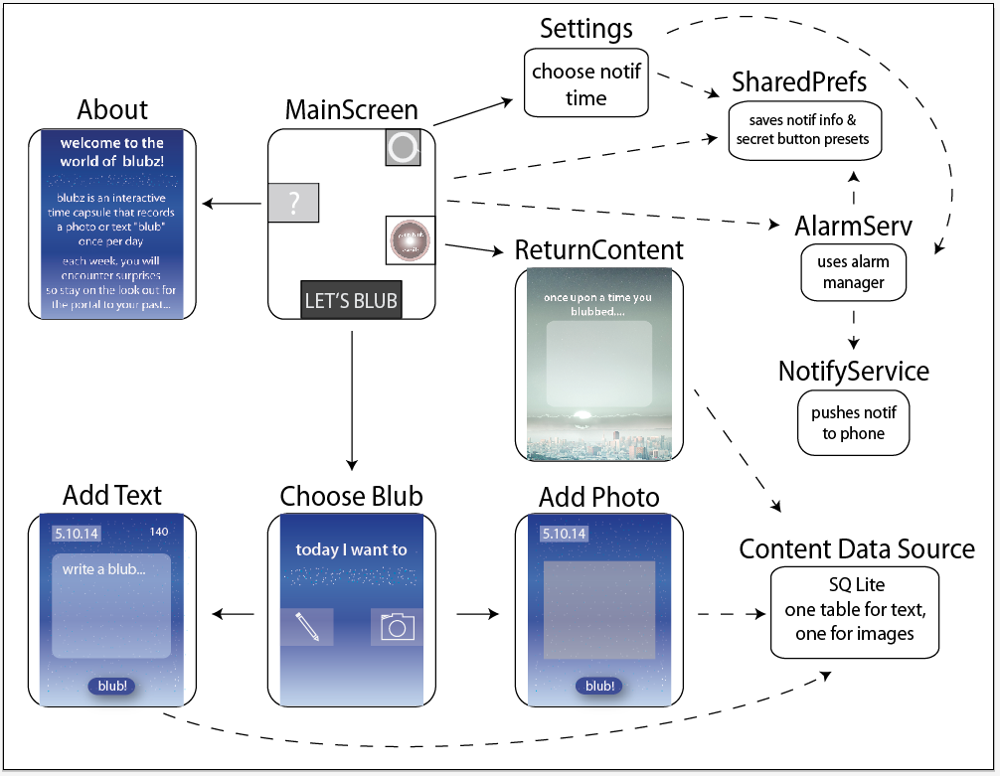

# blubz

This project is the brain-child of NADACADA and SWAG-APPS-INCORPORATED

"And on the 8th day, God created all things nostalgic and cute" -Genesis 6:66

An easily understandable system for storing text or pictures once each day with an exciting time-capsule-esque surprise.

## Architecture

blubz uses a SQLite database to store images and messages. Additionally, it uses SharedPreferences to store dynamic information, including users' notification preferences and the most recent timestamp of when the user pressed the "secret button."

Alarm service is used by MainScreen, Settings, and BootReceiver to set alarms through Android's AlarmManager for daily notifications and past blub notifications. When these alarms go off, NotifyService is started to push the specific notification to the user's phone.

## Client Development

All code was created on IntelliJ with a min Android SDK of API Level 17.
